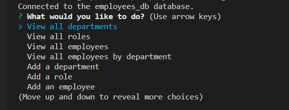
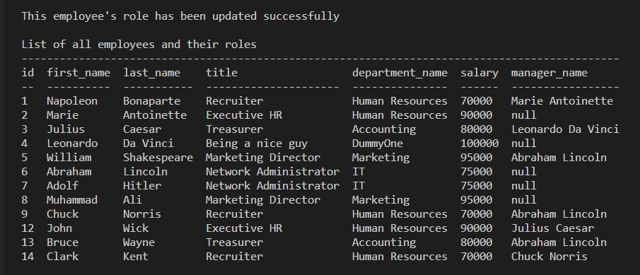

# Employee-Info-Management
A command line interface that allows business owners to view and manage the departments, roles, and employees in their company, built with Node.js, Inquirer, and MySQL.

A video demo of the app can be found [here](https://drive.google.com/file/d/1y7oAtQ_GyohJ_CHBhxgDY1fetrudCTNS/view)

## Screenshot

## Features

- Built with Node, Inquirer, and MySQL
- User can browse through a list of options to manage their employee database
- They can input various informations such as adding new departments, job titles, and new employees

## Table of Contents 

* [Installation](#installation)

* [Usage](#usage)

* [License](#license)

* [Contributing](#contributing)

* [Tests](#tests)

* [Questions](#questions)

## Installation

To install necessary dependencies, run the following command:
~~~
npm i
~~~

Insert mySQL password directly or via dotenv

Run schema.sql and seeds.sql

## Usage

Perform a git clone and run the code with "npm start"

## License

MIT

## Contributing

Fork the repo and create pull requests

## Tests

To run tests, run the following command:
~~~
npm test
~~~
## Questions

If you have any questions about the repo, open an issue or contact me directly at Algarvian2001@yahoo.com. You can find more of my works at [NganPham89](https://github.com/NganPham89).
